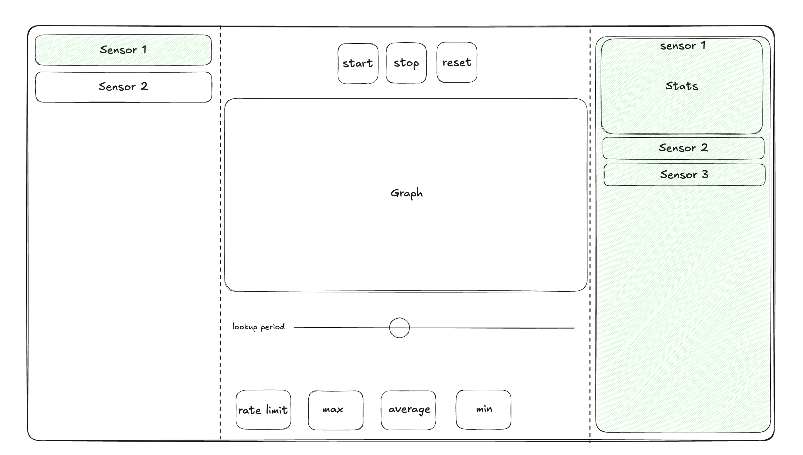

# Sensor Dashboard 📈

A dashboard that shows the data in real time for a list of sensors.

## Getting Started

First, run the development server:

```bash
npm install

npm run dev
```

Open [http://localhost:3000](http://localhost:3000) with your browser to see the result.

**Make sure to run the server on a different port (3001)



## How to use
- Press the `Start` button to start the stream
- Press the `Stop` button to stop the stream
- Press the `Reset` button to reset the stream

Press on one or more sensors from the list to see the data in the graph in real time.

Control the graph resolution by changing the lookup period.

Watch the aggregated data in the table on the right side of the graph.

## Description

I choose to split the screen into three parts:
- The left part is the list of sensors that you can select to see the data in the graph.
- The center part is the control panel that contains the buttons, the real-time data points in the graph by the sensor, and the lookup period input.
- The right part is the table containing all sensors' aggregated data.

In this way, the user can easily interact with the sensors, see some aggregated stats, and see the data in real-time print to the screen.
The graph is updated every 0.1 seconds with the new data points.

## Findings
- While aggregating the data, I found that the average data points of each one of the sensors strive for zero, and the total average of all values as well.
- We can see if the sensors have more positive or negative values when looking at the sum of any data point.
- When playing with the lookup period, we can see the data points in the graph change accordingly and learn more about the sensor's data by looking at the spikes in the graph.

## Limitations
- For the memory to not overflow, I limited the data points in the graph to MAX_DATA_POINTS=200. If we want to increase this number, we should consider storing the old data somewhere.
  I suggest storing the data in the server and pulling only the data we want to see in real-time.
- This implementation can work for 20 sensors - if we want to extend it to more sensors, we should consider using a different approach to render the sensor list and the data points in the graph by looking at a subset of sensors at a time.
- I currently use a single message queue to store messages from the server. This could create a bottleneck if we receive a large volume of messages. To address this, we should explore alternative methods for storing messages, such as implementing a circular buffer or utilizing a different data structure that can handle the messages more effectively. Alternatively, an even better solution could be to store the data on the server and retrieve only the data we need to view in real time.

## Improvements
- The graph can be improved by adding more features like zoom in, zoom out, and more.
- The statistics table can be improved by adding aggregated data points like the median, variance, standard deviation, etc.
- For scalability, we can move the aggregations and other calculations to the server and pull the data using an API call.